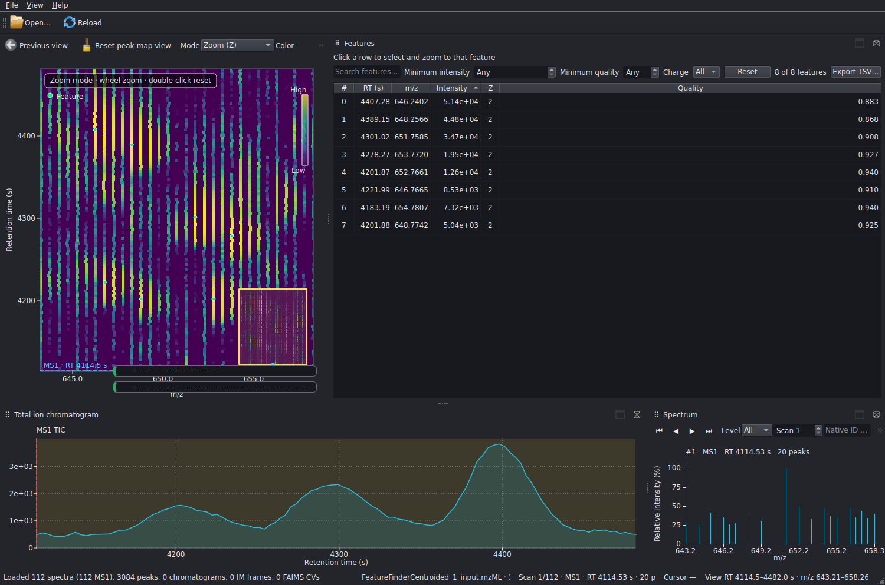
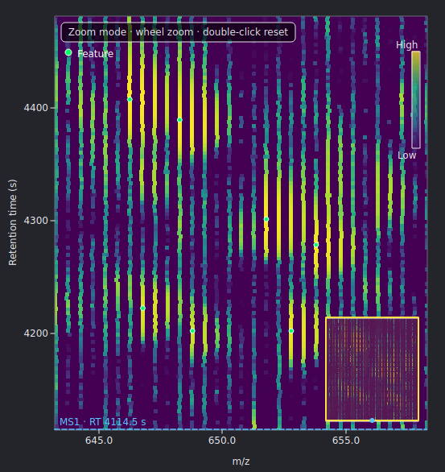
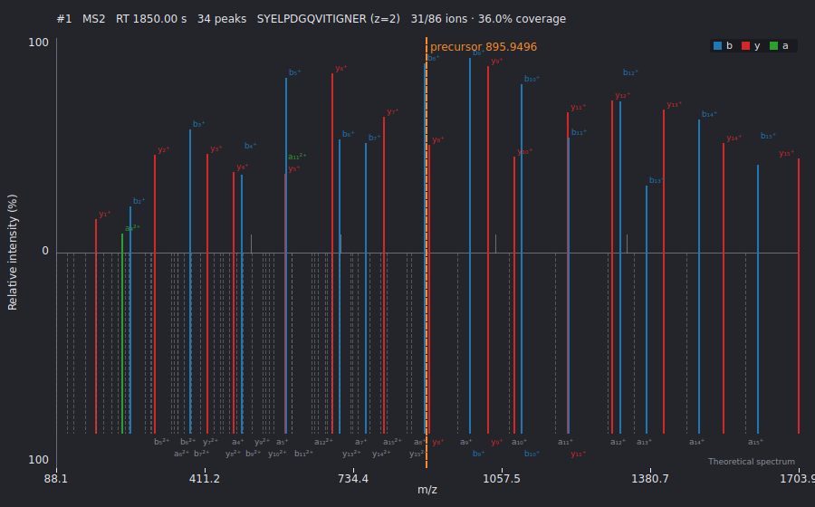
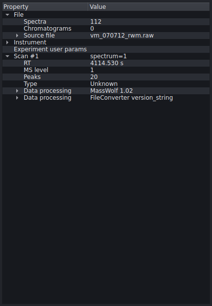
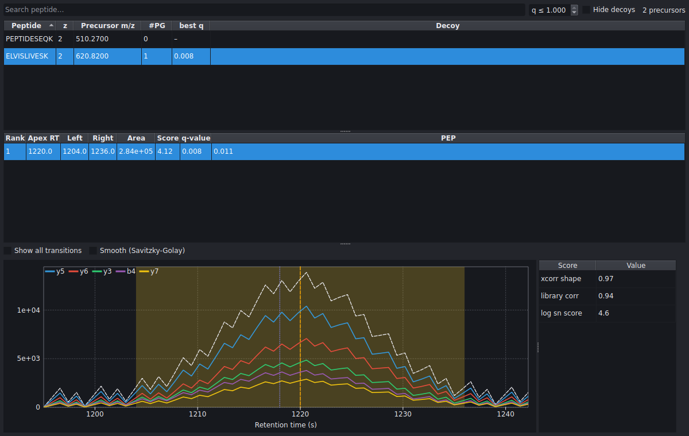
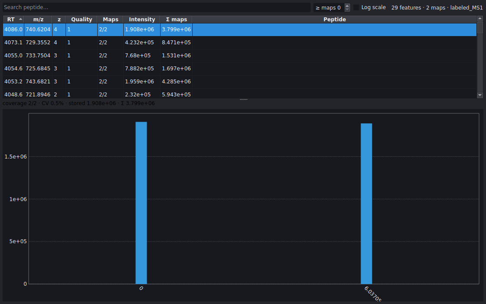
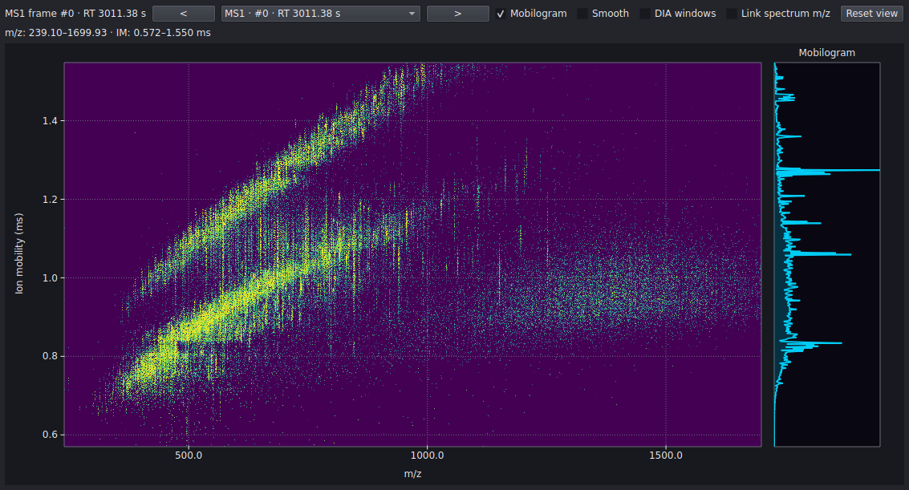
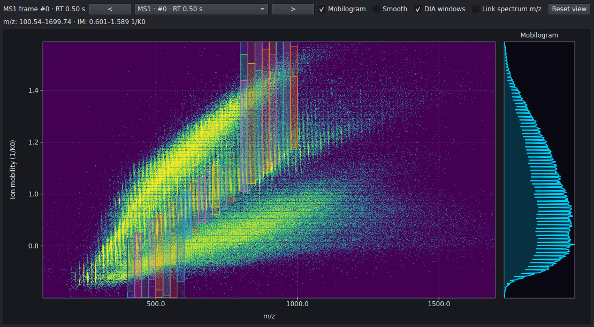
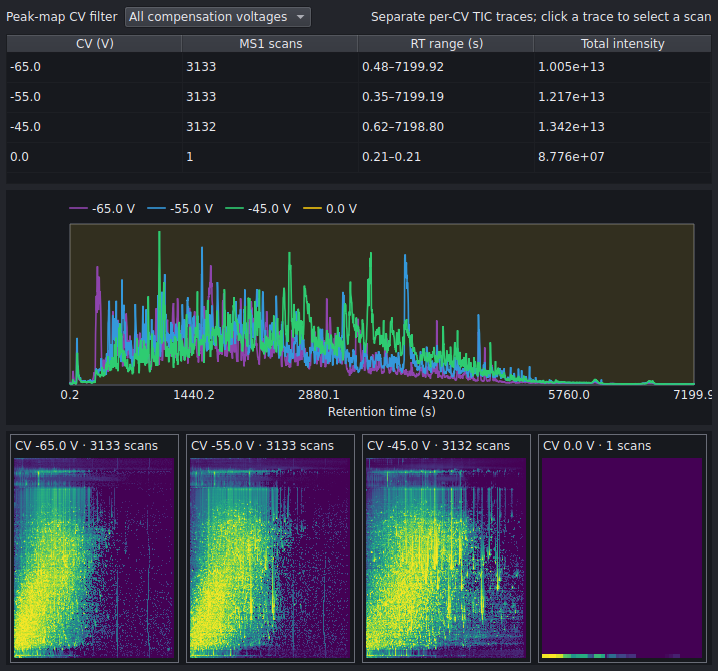
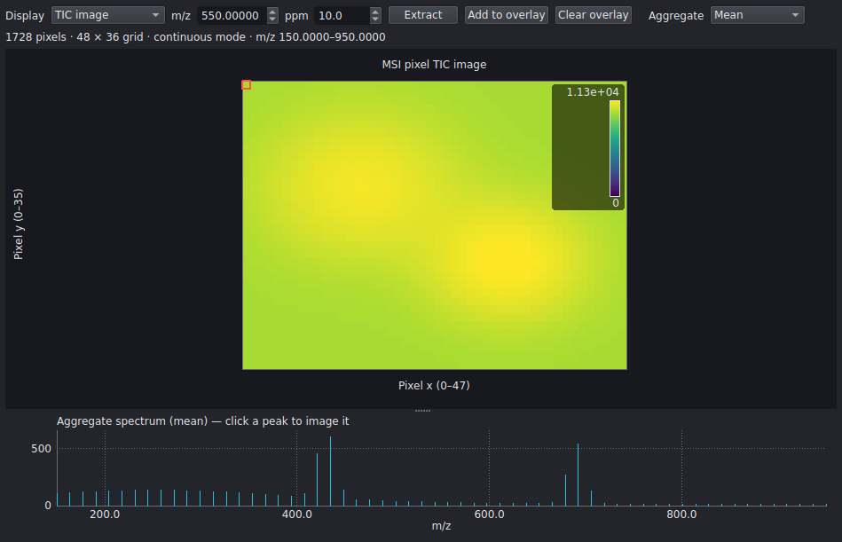

# OpenMS Viewer

**A standalone C++/Qt 6 desktop application for interactive mass-spectrometry data inspection — the intended successor to TOPPView.**

OpenMS Viewer links against the **OpenMS 3.6 core library** (not TOPPView, not the
OpenMS GUI library) and ships as a separate project. Everything is rendered with
custom `QPainter` canvases — no WebEngine, no external plotting library — so the
full run stays in memory while only the visible RT/m·z range is rasterized at
screen resolution.



*The main window: a screen-resolution MS1 peak map with feature centroids and a
clickable minimap (left), a sortable/filterable feature table (right), the MS1
total-ion chromatogram (bottom-left), and the fragment spectrum for the selected
scan (bottom-right). Every panel is a movable, closable Qt dock.*

---

## Highlights

- **One in-memory experiment, screen-resolution rasterization.** The MS1 peak map
  is drawn by OpenMS native `rasterizeRTMZ` at exactly the pixels on screen, with
  histogram-equalized / log / square-root / linear intensity scales and seven
  colormaps.
- **Everything loads asynchronously and atomically.** mzML, FeatureXML, idXML,
  consensusXML, and OpenSWATH results load on worker threads and are swapped into
  the view in one atomic step — a failed or cancelled load never corrupts what
  you are looking at. Loaders are order-independent; command-line arguments in any
  order converge to the same linked state.
- **One selection, everywhere.** A single selection controller keeps the peak map,
  spectrum, tables, TIC, and detail panels in lock-step without recursive feedback.
- **Rich-format aware.** Beyond mzML it opens featureXML/featureparquet,
  idXML/mzIdentML/idparquet, consensusXML/consensusparquet, OpenSWATH `.osw`
  (with lazy `.xic`/`.sqMass` chromatograms), imzML imaging, and Thermo/Bruker
  vendor raw data — each routed to the view idiom that fits it.

---

## The peak map



*A real 17 743-spectrum Thermo LTQ-Velos run (PXD000155, from archive.openms.de),
rasterized at screen resolution with the color-scale legend and live minimap.*

The central canvas rasterizes the visible RT × m·z window on every interaction:

- **Navigation** — wheel zoom, rectangle zoom, `Alt`-drag pan, `Shift`-drag
  Δm·z / ΔRT measurement, a full zoom history, RT/m·z axis swapping, and a
  Go-to-Range dialog.
- **Minimap** — a clickable thumbnail of the whole run with a live viewport
  rectangle for orientation while zoomed in.
- **Overlays** — feature centroids, bounding boxes, and convex hulls;
  identification markers with optional sequence labels; consensus centroids with
  their alignment envelope; and MS/MS precursor + isolation-window markers. Each
  overlay is an independent, view-culled, capped layer with its own legend entry.
- **Interaction modes** — Zoom, Pan, Measure, and **Edit** (see *Manual feature
  editing* below).

## Spectra and fragment annotation



*A b/y/a-annotated MS/MS spectrum with the theoretical spectrum mirrored below,
the precursor marked, per-ion labels, and live coverage statistics
(31/86 ions · 36 % here).*

The spectrum viewer offers first/previous/next/last and MS-level-specific
navigation, scan-number / native-ID / RT lookup, persistent wheel and box m·z
zoom, snapped peak hover with automatic m·z labels, and two-peak Δm·z
measurement. Fragment ions are annotated from OpenMS theoretical spectra (b/y/a
ions) or from external idXML fragment annotations, with a configurable Da
tolerance, coverage statistics, and an optional **mirror view** that shows the
unmatched theoretical ions beneath the observed spectrum.

## Features, identifications, and tables

Every tabular view is a sortable model/proxy with column filters, TSV export,
table-to-map zoom, and **bidirectional selection synchronization** with the plots:

- **Feature table** — intensity, quality, and charge filters; click a row to zoom
  the map to that feature.
- **Identification table** — linked/unlinked and sequence/score filters, all-hit
  inspection, and per-hit metadata. idXML↔spectrum links are *recomputed* whenever
  either side changes (5 s RT / 0.5 Da precursor tolerance), and every spectrum
  keeps its lowest-error match as a preferred default.
- **Spectra table** — MS-level, RT, identification, sequence, and score filters,
  optional cached statistics/metadata, and a row for every linked identification
  and peptide hit.

### Manual feature editing

The peak map's **Edit** mode makes the feature map directly editable: drag a
centroid to move it, double-click to open an editor for RT / m·z / intensity /
charge, `Delete` to remove, or click empty space to create a new feature. Edits
that only change intensity or charge preserve the convex hull; moving the centroid
falls back to a bounding box. The edited map round-trips back out through
`FeatureXMLFile`.

## Metadata browser



*The real LTQ-Velos run's metadata — instrument model, source file, acquisition
date, and per-scan detail.*

A read-only tree exposes the full OpenMS metadata hierarchy: source file and
checksum, instrument configuration (ion sources, mass analyzers, detectors,
software), sample, experiment-level user parameters, and — for the selected scan —
RT, MS level, spectrum type, precursors with isolation window and activation
method, data processing steps, and per-scan user parameters. Enum values
(ionization method, analyzer type, …) are rendered through bounds-checked OpenMS
name tables.

## OpenSWATH / DIA results



Open an OpenSWATH `.osw` result and the viewer becomes a targeted-DIA browser:

- a **searchable precursor table** (peptide, charge, precursor m·z, peak-group
  count, best q-value) with a q-value threshold and a hide-decoys toggle;
- a **candidate peak-group table** (rank, apex RT, left/right boundary, integrated
  area, main score, q-value, PEP);
- a **transition-group plot** drawing every transition XIC on one RT axis with the
  selected peak-group boundary shaded, the apex and library RT marked, an
  optional Savitzky-Golay smoothing overlay, and a "show all transitions" toggle;
- a **score inspector** listing the sub-scores for the selected peak group.

Chromatograms are fetched off the GUI thread with stale-request coalescing and a
small cache. Both `.xic` (Parquet) and `.sqMass` chromatogram sources are
supported; the `.sqMass` reader is **lazy** — it decodes only the transitions of
the selected precursor and never mutates the input database.

## Consensus maps



consensusXML / consensusparquet open into a consensus table (RT, m·z, charge,
quality, map coverage, stored vs. summed intensity, best identification) beside a
**per-map intensity chart** built from the selected feature's handles. Missing
maps are shown as gaps — never zero-height bars — with a raw/log toggle, coverage
and CV readouts, and grouping by the map column headers. Selecting a consensus
feature highlights its handles and, where the handle resolves to the loaded raw
run, links through to the underlying spectrum.

## Ion mobility and diaPASEF



*A real Bruker timsTOF diaPASEF frame (HeLa 50 ng, from archive.openms.de) — one
of 8 822 frames / 127 million peaks — as an m·z × ion-mobility density map with the
characteristic charge-state bands, a side mobilogram, and frame navigation,
rendered by OpenMS `rasterizeIMFrame`.*



For diaPASEF data the viewer additionally reconstructs the **isolation-window
scheme** across the acquisition cycle and overlays every m·z × ion-mobility window
box (deduplicated across cycles by m·z window and mobility midpoint), making the
staircased window groups directly visible.

## FAIMS



*A real Thermo Exploris FAIMS-DDA run (from archive.openms.de) with four
compensation voltages over a 7 200 s gradient.*

Multi-CV datasets are detected automatically: a per-CV summary table, separate
per-CV TIC traces, a compensation-voltage filter shared by the peak map and TIC,
and synchronized per-CV peak-map small multiples. Table selection and spectrum
navigation keep the active channel consistent.

## Imaging (MSI)



imzML/IBD datasets open **on-disc** with lazy spectrum decoding — the full imaging
experiment is never held in memory. The panel shows TIC and ppm-window ion images,
a whole-image aggregate spectrum (click a peak to image it), pixel-to-spectrum
navigation, and additive multi-ion RGB overlays.

Bruker **timsTOF MALDI `.d`** imaging directories (`.tdf` with a `MaldiFrameInfo`
table) are also read — via OpenMS `BrukerTimsImagingFile`, feeding the same imaging
pipeline. (Single-quad `.tsf` MALDI has no OpenMS reader and is rejected with a
clear message. The screenshot above is a synthetic image pending a real `.tdf`
MALDI dataset.)

## Vendor raw data

Thermo `.raw` (needs a .NET runtime for the bridge) and Bruker timsTOF `.d`/TDF
(opentims, no vendor SDK) load through the OpenMS backends when present; Bruker
`.d` surfaces ion mobility straight into the IM panels.

## Export and write-back

- **Filtered mzML export** by RT, m·z, MS level, and active FAIMS CV, run
  asynchronously.
- **Native write-back** — save FeatureXML, idXML, and consensusXML (including
  manually edited feature maps) back through the matching OpenMS writer.
- **PNG capture** for every native plot and **TSV export** for every data table.

## Workspace

Movable, closable Qt dock panels remember your visibility choices across reloads;
floating panels have explicit dock/float controls and on-screen recovery, plus a
reset-layout action. The app supports native drag-and-drop, dark/light themes,
keyboard shortcuts, accessible plot descriptions, a focused welcome page with
recent files, and — instead of an embedded scripting console — a thread-safe,
searchable, saveable **diagnostics log**.

---

## Supported formats

| Category | Formats | View |
|----------|---------|------|
| Spectra / experiment | `mzML`, `mzXML`, `mzData`, `sqMass` | Peak map, TIC, spectrum |
| Feature maps | `featureXML`, `featureparquet` | Feature table + map overlay |
| Identifications | `idXML`, `mzIdentML` (`.mzid`), `idparquet` | ID table + annotation |
| Consensus maps | `consensusXML`, `consensusparquet` | Consensus table + per-map chart |
| OpenSWATH results | `.osw` (+ `.xic` / `.sqMass` chromatograms) | Peak-group browser |
| Imaging | `imzML` / `IBD`, Bruker MALDI `.d` (`.tdf`) | Ion-image viewer |
| Vendor raw | Thermo `.raw`, Bruker timsTOF `.d` | Peak map (+ IM for `.d`) |

Routing is by semantic *category* via an audited `FileHandler::getType` registry —
never by file suffix or inconsistent format capability flags.

## Build, test, run

Requires an OpenMS 3.6 development build/install and Qt 6.4+. Point CMake at
OpenMS via `-DOpenMS_DIR`:

```bash
cmake -S . -B build -DOpenMS_DIR=/path/to/OpenMS-build
cmake --build build -j
ctest --test-dir build --output-on-failure
```

Run the app (all file arguments optional, any order):

```bash
./build/openms-viewer [sample.mzML] [features.featureXML] [ids.idXML]
```

A Bruker `.d` dataset is a directory — open it via **File → Open data folder…** or
drag the folder in. Thermo `.raw` needs a .NET runtime available (set
`DOTNET_ROOT` if it is not auto-detected); a missing runtime fails with a clear
message rather than a crash. The Windows portable artifact bundles and selects
its own .NET 8 runtime. Vendor loading requires the linked OpenMS to be built with
`WITH_THERMO_RAW` / `WITH_OPENTIMS`.

Default build type is `RelWithDebInfo`; `CMAKE_CXX_STANDARD` is 23; Qt AUTOMOC/
AUTOUIC/AUTORCC are on.

## Screenshots

The images in this README are regenerated by a committed tool
(`openms-viewer-gallery`) so rendering changes surface as image diffs in git. The
raw-centric views are rendered from **real datasets on archive.openms.de** (cached
by `tools/screenshots/fetch-data.sh`); derived views use OpenMS fixtures. See
[docs/screenshots.md](docs/screenshots.md) to regenerate, and
[docs/comparison-pyopenms-viewer.md](docs/comparison-pyopenms-viewer.md) for a
rendering comparison against the Python `pyopenms-viewer`.

## Architecture

The code splits into two static libraries plus a thin executable:
`openms_viewer_core` (UI-independent: model, plot rasterizers, annotation, export,
logging) and `openms_viewer_ui` (widgets, dialogs, `MainWindow`). The core must
not depend on Qt Widgets, keeping headless logic testable and reusable.

- [docs/architecture.md](docs/architecture.md) — GUI framework decision and layer contract
- [docs/feature-matrix.md](docs/feature-matrix.md) — parity status vs. `pyopenms-viewer`
- [docs/performance.md](docs/performance.md) — 127-million-peak large-file smoke test and memory footprint
- [docs/packaging.md](docs/packaging.md) — CPack generators and deployment boundaries

## License

BSD-3-Clause. See [LICENSE](LICENSE).
