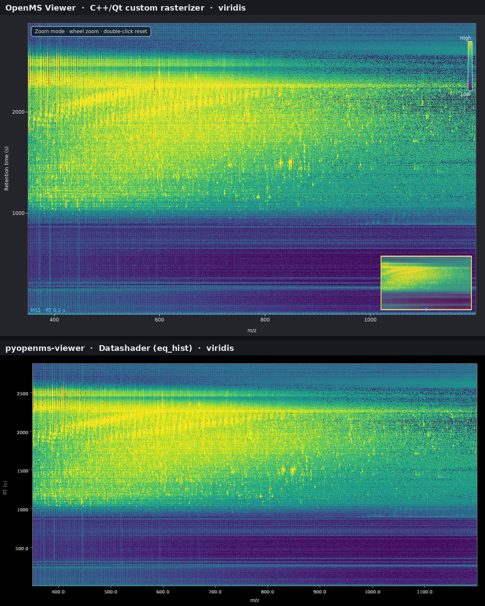

# Rendering comparison vs. pyopenms-viewer

[`pyopenms-viewer`](https://github.com/timosachsenberg/pyopenms-viewer) is the
Python reference this project set out to match and exceed: a NiceGUI + Datashader
+ Plotly web app over pyOpenMS. OpenMS Viewer is now broadly ahead on **scope**
(FAIMS small multiples, real diaPASEF ion mobility + isolation-window overlay,
consensus maps, OpenSWATH peak groups, a metadata browser, 3D, vendor raw — none
or few of which pyopenms-viewer renders). This note is the honest other side:
**where pyopenms-viewer still renders nicer.**

## Method

Both viewers rendered the **same real dataset** — the Thermo LTQ-Velos run
`20100609_mAbBBA2_JDH_110` (PXD000155, 17 743 spectra) from archive.openms.de —
over the same RT/m·z window and the **same viridis colormap**, so only the
rendering pipeline differs. OpenMS Viewer uses its C++/Qt `PeakMapRasterizer`
(`rasterizeRTMZ`, histogram-equalized); pyopenms-viewer uses Datashader
(`ds.Canvas` + `tf.shade(how="eq_hist")`). The pyopenms-viewer image was produced
with:

```python
from pyopenms_viewer.core.state import ViewerState
from pyopenms_viewer.loaders.mzml_loader import MzMLLoader
from pyopenms_viewer.rendering.peak_map_renderer import PeakMapRenderer
s = ViewerState(); MzMLLoader(s).load_sync(path); s.colormap = "viridis"
png = PeakMapRenderer().render(s, fast=False, draw_axes=True)  # base64 PNG
```



## Where pyopenms-viewer renders nicer

- **Smoother density field.** Datashader's antialiased aggregation plus `eq_hist`
  tone-mapping yields a more continuous, photographic gradient. Side by side, the
  OpenMS Viewer raster shows slightly more per-pixel granularity/speckle in the
  mid-intensity regions, where Datashader reads as a smooth wash.
- **Cleaner default plot framing.** pyopenms-viewer's matplotlib-style axes are
  thin and crisp with a bare, publication-clean frame. OpenMS Viewer overlays more
  chrome (mode hint, color-scale legend, minimap) — more informative, but busier.
- **Vector-crisp, interactive 1-D plots.** The spectrum, TIC, and chromatogram
  panels are Plotly (`go.Figure`) — resolution-independent lines, rich hover
  tooltips, and smooth web pan/zoom. OpenMS Viewer's `QPainter` 1-D plots are fast
  and correct but raster, with lighter hover affordances. For a crisp annotated
  spectrum or a hover-to-read TIC, the Plotly output is the more polished artifact.
- **Perceptually-tuned overlays.** Feature hover/selection glows and the crosshair
  spectrum marker are composited with soft alpha in the browser; OpenMS Viewer's
  equivalents are solid-stroke QPainter markers.

## Where OpenMS Viewer is at least even

- **Informative chrome:** a color-scale legend, a live minimap + viewport
  rectangle, interaction-mode hints, and persistent cursor/run/selection context —
  none of which the bare pyopenms-viewer plot provides.
- **Breadth of rendered views** (see above) and **in-process rendering** with no
  server/browser round-trip, which is what lets it stay responsive while holding
  the whole run — including a 127-million-peak diaPASEF frame set — in memory.

## Takeaway

On the 2-D peak map the two are close; Datashader's smoother tone-mapping is the
clearest win, and it is worth chasing in the C++ rasterizer (softer antialiasing /
an `eq_hist`-style tonal ramp). The larger, more general gap is the **1-D plots**:
Plotly's vector rendering and hover polish set the bar the `QPainter` spectrum/TIC/
chromatogram canvases should aim for as they move toward `QOpenGLWidget`.

Regenerate this comparison with the snippet above; see
[screenshots.md](screenshots.md) for the full pipeline.
