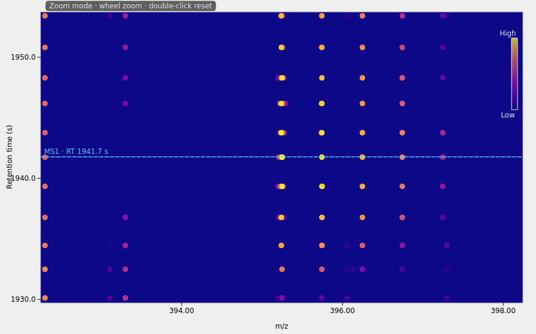
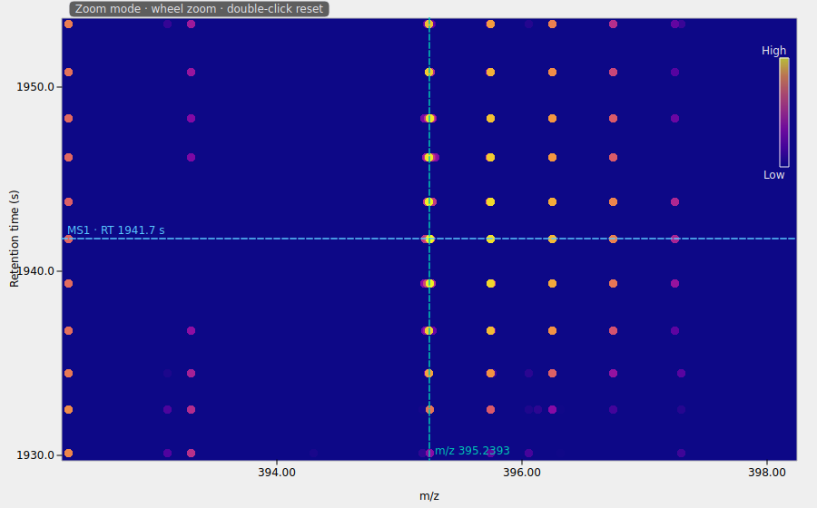
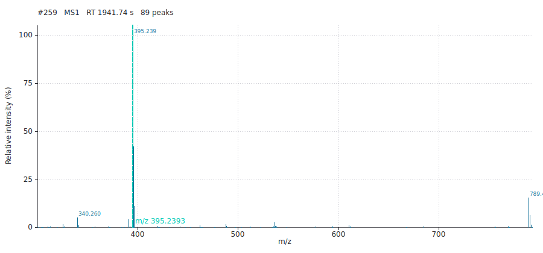

# Design note — Issue #21: m/z annotation + bidirectional peak selection

Status: implemented
Issue: https://github.com/timosachsenberg/openms-viewer/issues/21

## Result

Before (RT marker only) vs after (adds the pinned teal m/z line + label); the
same m/z is mirrored in the spectrum plot.

## Problem

Clicking a peak in the 2D peak map annotates only the RT (a dashed RT line +
label). Users want the **m/z** annotated too — its own line + label — and a
TOPPView-style hover highlight showing the m/z / RT / intensity of the peak
under the cursor.

## Core model

`SelectionController` gains a first-class, cross-panel **selected m/z**:

- `std::optional<double> mz_`, `setMz(std::optional<double>)`,
  `mzChanged(double mz, bool valid)` (validity is explicit — a bare `double`
  cannot represent "cleared"), reset in `clear()` and on new-file load.
- It is a **pure m/z reference**, never a peak — it carries **no intensity**.
  This is what makes cross-scan persistence *truthful*: no intensity/dot claim
  can go stale when you navigate to a scan where that peak does not exist.

This satisfies the "one selection source of truth" invariant
(`CLAUDE.md`): the m/z is genuinely cross-panel (see producers/consumers), so it
belongs in the controller rather than in a widget.

## Producers — either panel commits the m/z

**Peak map** — plain left-click, only on a *plain raster* click. Feature /
identification / precursor clicks navigate but do **not** commit m/z (two
independent booleans — do not key the commit to `!specificNavigation`, because
feature clicks still emit `rtActivated`):

- snap ON + on a peak → `setMz(peak m/z)`
- snap ON + blank / zoomed-out → `setMz(nullopt)` (clear)
- snap OFF → `setMz(raw cursor m/z)` (always commit)

**Spectrum widget** — left-click with no drag (`< 6 px`), **normal mode only**
(measurement / label modes and drag-zoom unchanged):

- on a peak → `setMz(peakAt m/z)`
- blank → `setMz(nullopt)`
- **always snaps** via `peakAt()`; the global snap toggle does *not* gate the
  spectrum pick (a 1D spectrum is inherently discrete peaks).

## Consumers — both panels draw the m/z

Both draw a distinct **teal line** at `SelectionController.mz` with an
`m/z 445.1203` label — **no dot, no intensity**:

- Peak map: line perpendicular to the m/z axis (both `axesSwapped`
  orientations), mirrored on the minimap.
- Spectrum widget: vertical line at that m/z.

The line **persists** across spectrum navigation; it is replaced by the next
pick in either panel and cleared on blank-click / reload / `clear()`. A pick in
either panel shows immediately in both.

## Hover (peak map only, transient, widget-local — NOT in the controller)

Active in Zoom & Pan modes; change-guarded on a new `hoveredPeak_` member
(mirrors the existing `hoveredFeature_` repaint guard):

- resolvable peak → a **dot** on the peak + status-bar exact triple
  `RT · m/z · I`.
- otherwise → raw cursor `RT · m/z`, no dot, no intensity.

MainWindow already treats `intensity >= 0` as "on a peak", so **no `onPeak`
parameter** is added to `cursorPositionChanged`. Hover is always active
regardless of the snap toggle (a read-only peek is harmless). `snapToPeak()` is
upgraded to return the full `{rt, mz, intensity}` triple instead of discarding
intensity.

## Snap toggle

Checkable action, default ON, grouped with **interaction** controls (not
Display). MainWindow owns it and pushes `setSnapToPeak(bool)` to the peak map.
It governs peak-map **click-commit** policy and **Measure** snapping only — never
the hover highlight, never the spectrum pick.

## Deferred

- `peakAtPixel()` true 2-D hit-test — keep RT-first `nearestPeak` /
  `snapToPeak` for now; accept the rare adjacent-scan miss.

## Tests

- Controller: `setMz` / `mzChanged` validity / `clear` reset.
- `PrecursorOverlayTest` (offscreen): raster click commits m/z;
  feature / id / precursor click does **not**; blank click clears; snap-off
  commits raw; both axis orientations; minimap mirror.
- `SpectrumInteractionTest`: click-no-drag on a peak commits; drag still zooms;
  measurement / label modes do not commit; both panels' lines reflect one
  `setMz`.
